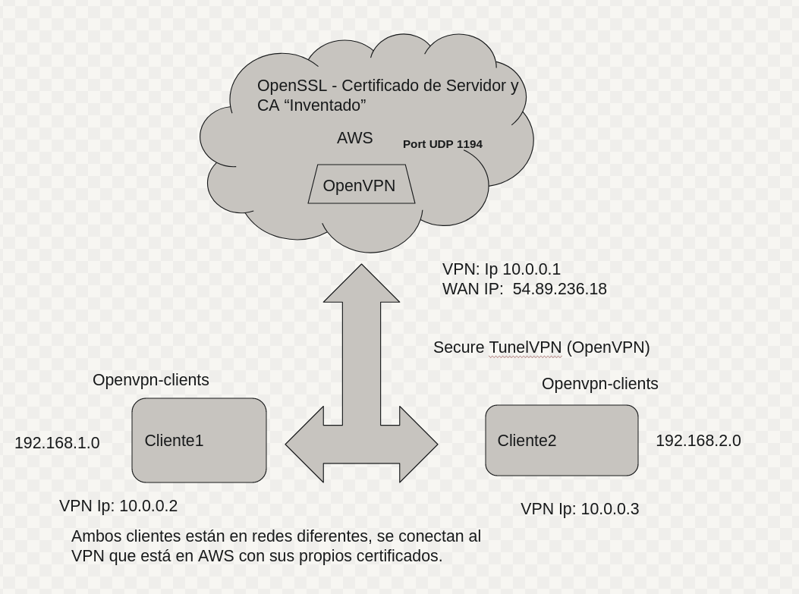

# How to OpenVPN

__ssl22:vpn__ Fitxers de claus i certificats per crerar túnels virtuals amb OpenVPN. Utilitza l'entitatt de certificació VeritatAbsluta i crea certificats propis per a client i servidor.

Consisteix en fer una VPN entre dos hosts (client1 i client2), estiguin on estiguin en una mateixa LAN o separats per internet. 

Podeu usar dos ordinadors de l’aula, o dos de casa o un ordinador de casa i un a AWS EC2 (caldrà obrir els ports apropiats de VPN __UDP 1194__). 

__Quan els dos ordinadors es comuniquen per la seva interfície pública el tràfic és insegur.__

`Quan es comuniquen entre ells utilitzant les interfćies dels túnels el tràfic és segur.`


En aquest exemple es farà un túnel host to host igual que l’anterior però utilitzant com a mecanisme de xifrat del tràfic certificats digitals, és a dir, Clau pública / clau privada. 

El resultat funcional és el mateix que el de l’exemple anterior, però ara no cal cap secret compartit entre els dos peers. 

Així si, cal disposar del conjunt de certificats apropiats


Com que el model de tràfic segur TLS/SSL està dissenyat per actuar amb els rols de client/serer aqui triarem arbitràriament un dels hosts de client i l’altre de server (by the face!).

Per tant un tindrà els certificats de client i l’altre els certificats de server.

----

# Practica Final

Crear una topologia amb dos clients locals i un servidor OpenVPN a AWS EC2. 

Els clients han d’establir un túnel VPN amb el servidor de AWS i s’han de poder comunicar entre ells a través del túnel.

Com a clients podeu usar dos hosts de casa o de l’aula. També podeu usar dos hosts de docker però que estiguin en xarxes diferents, que NO puguin tenir connectivitat entre ells si no és a través del túnel.

<div>
    
</div>

<br>

--------------------------------------------------------------------------------------------------------------------------------------------------------------------

<br>


<div>
    
</div>

En aquest exemple el mecanisme de xifrat és utilitzar com a ​ Key un ​ pre-shared-secret ​ . 

És a dir, un secret compartit per els dos extrems de túnel. 

En configurar el túnel s’ha acordat un __secret compartir__ que saben les dues parts (per exemple jupiter) i que és la clau d’encriptació del tràfic segur. 


# Objetivos

1. Implementar 2 `OpenVPN Client` con `systemctl` en local, deben estar en __distintas redes__.

2. Implementar un `servidor OpenVPN + OpenSSL a AWS`.


3. Se utilizan `certificados propios generados` y no los certificados por `defecto de OpenVPN`.

> NOTA: 

4. Permitir la comunicación `cliente a cliente` a través del `túnel VPN`.

5. Se usará una `Entidad de Certificación CA` = _Veritat Absoluta_ --> Emitirá los certificados para __edt.org__. 

    * Certificado para servidor

    * Par de certificados para cliente

6. Crear **certificados**:

    * Test-server --> Server

    * Test-Client1 --> Host1

    * Test-Client2 --> Host2

7. Vigilar las __extensiones__ --> Tiene que cumplir unos __requisitos__ para ser válidos para OpenVPN.

8. El __servidor que está a AWS__ tiene que permitir el tráfico __UDP__ al __puerto 1194__.

9. Consultar información: [OpenVPNSampleKeys](https://github.com/OpenVPN/openvpn/tree/master/sample/sample-keys)

    9.1 Generar `sample-keys` --> `openssl.cnf` y `script de generar las keys` --> `sample-keys gen-keys-keys.sh`

10. Mostrar el funcionamiento de una conexión `client to client` a través del túnel VPN.

* Activar algún servicio de red en los clientes que permita la `verificación` - `daytime (13)` - `echo (7)` - `web (80)` ... etc

____________________________________________________________________________


# Procedimiento

1. Conectarse a Amazon y abrir `Debian`, mi pc y otro ordenador de clase.

2. Desplegar el Debian de `AMAZON `con el puerto `UDP ``1194`.

3. Canet nos dará nombre de Entidad de Certificación inventado.

4. Los clientes locales estarán en redes distintas. (Se cambia manualmente el __network manager__).

5. Generar los Certificados para el Servidor de AWS a partir de la Entidad de Certificación. 

## Server AWS

0. Verificar que el servicio de Open VPN esté.

1. sudo `systemctl status openvpn@server.service`

2. `ip address show tun0`

### OpenSSL 


1. Generación de __PAR de CLAVES__ para el __Server de AWS__:

`openssl genrsa -out serverkey_vpn.pem`

<br>

2. Con la clave privada, firmamos el "__request__" y generamos el fichero "__serverreq_._vpn.pem__"

`openssl req -new -key serverkey_vpn.pem -out serverreq_vpn.pem`

Country Name (2 letter code) [AU]:__CA__
State or Province Name (full name) [Some-State]:__Barcelona__
Locality Name (eg, city) []:__bcn__
Organization Name (eg, company) [Internet Widgits Pty Ltd]:__edt__
Organizational Unit Name (eg, section) []:__vpn__
Common Name (e.g. server FQDN or YOUR name) []:__vpn.edt.org__
Email Address []:__vpn@edt.org__

Please enter the following 'extra' attributes
to be sent with your certificate request
A challenge password []:jupiter
An optional company name []:vpn


<br>


3. `ext.server.conf`: Extensión válida para OpenVPN Servidor

```
basicConstraints       = CA:FALSE
nsCertType             = server
nsComment              = "OpenSSL Generated Server Certificate"
subjectKeyIdentifier   = hash
authorityKeyIdentifier = keyid,issuer:always
extendedKeyUsage       = serverAuth
keyUsage               = digitalSignature, keyEncipherment

```

<br>

> __NOTA: Importante la KEY y la CA de la ENTIDAD hay que crearla antes__


4. Como CA "`Inventado`" - Cogemos el `Request` generado anteriormente y lo _firmaremos_ utilizando el fichero de __extensiones de Servidor__!

> __NOTA__: cakey.pem y ca_NOMBRE_cert.pem lo hemos generado anteriormente con LDAPS.

```
openssl x509 -CAkey cakey.pem -CA ca_ronaldo_cert.pem -req -in serverreq_vpn.pem -days 3650 -CAcreateserial -extfile ext.server.conf -out servercert_vpn.pem
```

Signature ok
subject=C = CA, ST = Barcelona, L = bcn, O = edt, OU = vpn, CN = vpn.edt.org, emailAddress = vpn@edt.org
Getting CA Private Key


<br>

5. Generamos nuestra propia clave __DH__ (Necesario para el Túnel VPN)

_Una `clau Diffie-Hellman` es una forma per a que les dos parts involucrades en una transacció SSL acordin un secret compartit en un canal insegur = SHARED SESSION KEY, aquestes parts no tenen coneixement previ_

```
openssl dhparam -out dh2048.pem 2048
```


<br>

6. Copiamos todo el contenido al `SERVIDOR DE AWS`

`sudo scp -i KeshiPortable.pem * admin@IP_PubAmazon`


```bash
isx36579183@i11:~/Documents/tunels_vpn22/ssl22-Pruebas$ sudo scp -i ../KeshiPortable.pem * admin@54.146.253.235:~
[sudo] password for isx36579183: 
The authenticity of host '54.146.253.235 (54.146.253.235)' can't be established.
ECDSA key fingerprint is SHA256:uqgYYVu3zoKUu/c4AH7qgLqyzdVM6WrMGqxNbhlRlbc.
Are you sure you want to continue connecting (yes/no/[fingerprint])? yes
Warning: Permanently added '54.146.253.235' (ECDSA) to the list of known hosts.
cakey.pem                                                              100%  887     9.1KB/s   00:00    
ca_ronaldo_cert.pem                                                    100% 1090    11.1KB/s   00:00    
ca_ronaldo_cert.srl                                                    100%   41     0.4KB/s   00:00    
dh2048.pem                                                             100%  424     4.4KB/s   00:00    
ext.server.conf                                                        100%  300     3.1KB/s   00:00    
servercert_vpn.pem                                                     100% 1623    16.5KB/s   00:00    
serverkey_vpn.pem                                                      100% 1675    17.1KB/s   00:00    
serverreq_vpn.pem                                                      100% 1094    11.2KB/s   00:00  

```

> `Instalar OpenVPN`: `sudo apt-get install openvpn`


> NOTE: Una vez copiada: Lo movemos todo a '/etc/openvpn/server'

`sudo cp * /etc/openvpn/server/`

<br>

Los archivos que tenemos que copiar a Amazon son los que tenemos en `./server`, importante tanto las `CLAVES` + `CONF DE SERVIDOR`.

Copiamos los archivos a la carpeta correspondiente `/etc/openvpn/server`, 

* Copiar:

    * __cakey.pem__

    * __ca_NOMBRE_cert.pem__

    * __dh2048.pem__

    * __ext.server.conf__

    * __serverkey_vpn.pem__

    * __serverrequest_vpn.pem__

    * __servercert_vpn.pem__

7. Cambiamos la configuración del `OpenVPN@.service`: 

`sudo vim /usr/lib/systemd/system/openvpn@.service`

> NOTE: Agregamos lo que indica la __práctica__, menos la parte de __servidor__.

<br>
¿?
<br>


9. Ahora se cambia el fichero `server.conf` los paths y copiamos a `/etc/openvpn/server` --> Se destacará la línea "_client-to-client_" necesaria para tener visibilidad a los extremos del túnel.

<br>

10. Se modifica: 

Cambiem això:

 ca /etc/openvpn/keys/ca.crt  
 cert /etc/openvpn/keys/server.crt  
 key /etc/openvpn/keys/server.key  
 dh /etc/openvpn/keys/dh2048.pem  

Per això:

 ca /etc/openvpn/server/ca_NOMBRE_cert.pem  
 cert /etc/openvpn/server/servercert_vpn.pem  
 key /etc/openvpn/server/serverkey_vpn.pem  
 dh /etc/openvpn/server/dh2048.pem  

 
tls-auth /etc/openvpn/server/ta.key 0


> Y la lñinea de CLAVE también tenemos que poner la ruta absoluta.

11. Pedir el `ta.key` (Se hace a /etc/openvpn/server)


```
sudo openvpn --genkey --secret ta.key  
```

sudo systemctl daemon-reload

sudo systemctl start openvpn@server.service

sudo journalctl -u openvpn@server.service -f &

sudo journalctl -u openvpn@server.service -f &


<br>

12. Encendemos el `servicio --> openvpn@server.service`:

`sudo systemctl start openvpn@server.service`

Para ver errores journalctl -xe  o journalctl -u openvpn@server.service

o también:

`ps -ax | grep openvpn`

<br>

13. OBSERVAMOS CÓMO SE HA CREADO LA INTERFÍCIE VIRTUAL DEL TUNEL: __TUN__.

`ip a`

`ip address show tun0`

4: tun0: <POINTOPOINT,MULTICAST,NOARP,UP,LOWER_UP> mtu 1500 qdisc pfifo_fast state UNKNOWN group default qlen 100
    link/none 
    inet 10.8.0.1 peer 10.8.0.2/32 scope global tun0

`10.8.0.1` --> GATEWAY será la VPN IP del Servidor VPN y las demás IP __podrán ser clientes__.


--

# Comandos para verificar el VPN

* ip address show tun0

* nmap ip

* `Observamos la conectividad del túnel`

Desde el client: ping 10.8.0.1

Des de el servidor: ping 10.8.0.X ( Se sabrá al iniciar el Servicio y poder analizar tun0 )


# CLIENTE (2 DOCKERS o MAQ REAL)

## Config client VPN (tant 1 com 2)

## Client1

## Generem clau privada simple per el client:

```
openssl  genrsa -out clientkey.1vpn.pem
```


## Amb la clau privada, signem el 'request' i generem el fitxer 'clientreq.vpn.pem':


```
openssl req -new -key clientkey.1vpn.pem -out clientreq.1vpn.pem
```

You are about to be asked to enter information that will be incorporated
into your certificate request.
What you are about to enter is what is called a Distinguished Name or a DN.
There are quite a few fields but you can leave some blank
For some fields there will be a default value,
If you enter '.', the field will be left blank.
-----
Country Name (2 letter code) [AU]:CA
State or Province Name (full name) [Some-State]:Barcelona
Locality Name (eg, city) []:bcn
Organization Name (eg, company) [Internet Widgits Pty Ltd]:__edt__
Organizational Unit Name (eg, section) []:__client1__
Common Name (e.g. server FQDN or YOUR name) []:__client1.edt.org__
Email Address []:__client1@edt.org__

Please enter the following 'extra' attributes
to be sent with your certificate request
A challenge password []:jupiter
An optional company name []:client1


## Com a CA, agafem el 'request' generat previament i signarem utilitzant el fitxer d'extensions de (client tant com el client1 com el 2):
```
openssl x509 -CAkey ../cakey.pem -CA ../cacert.pem -req -in clientreq.1vpn.pem -days 3650 -CAcreateserial -extfile ../server/ext.client.conf -out clientcert.1vpn.pem
```


Signature ok
subject=C = CA, ST = Barcelona, L = bcn, O = edt, OU = client1, CN = client1.edt.org, emailAddress = client1@edt.org
Getting CA Private Key


#### Ejemplo fichero __ext.client.conf__
basicConstraints        = CA:FALSE
subjectKeyIdentifier    = hash
authorityKeyIdentifier  = keyid,issuer:always


### Ens copiem el `fitxer de conf de client` (a la ruta on toca) i certificats i clau --> `/etc/openvpn/client`

#### A /etc/openvpn/client/`client.conf`

#### s'ha de canviar la ip a mà:

remote IP_AWS port (1143)


# Docker

1. Se inicializa una Docker: 

`docker build -t keshikid03/ssl22:client0 .`

`docker network create --subnet=172.20.0.0/16 net1`

`docker run --rm --name client0.edt.org -h client0.edt.org --net net1 -p 13:13 -it keshikid03/ssl22:client0`

> NOTA: /bin/bash no cal pq ja ho fa el __startup.sh__

> Enrutament? 


2. Añadir el __ip_forward__ para que se pueda usar de ROUTER. 

`echo 1 > /proc/sys/net/ipv4/ip_forward`


# Prueba

## TENINT EL PORT daytime (port 13) FUNCIONANT, podem fer proves tipus...

  CLIENT 1 A CLIENT 2:

        telnet client2.edt.org 13
        (hauria de tornar el dia/hora)


> `PAG 34 - REVISAR`


# Cliente 2


* **Generemos clave privada simple para el cliente:**
```
openssl genrsa -out clientkey.2vpn.pem
```

**Con la clave privada, firmamos el 'request' y generamos el archivo 'clientreq.vpn.pem':**
```
openssl req -new -key clientkey.2vpn.pem -out clientreq.2vpn.pem
You about to be asked to enter information that will be incorporated
into your certificate request.
What you about to enter what se encuentra en Distinguished Name or en DN.
There are quite a few fields but you can leave some blank
For some fields there will be a default value,
If you enter '.', the field will be left blank.
-----
Country Name (2 letter code) [AU]:CA
State or Province Name (full name) [Some-State]:Barcelona
Locality Name (eg, city) []:bcn
Organization Name (eg, compañero) [Internet Widgits Pty Ltd]:edt
Organizational Unit Name (eg, section) []:client2
Common Name (e.g. server FQDN or YOUR name) []:client2.edt.org
Email Address []:client2@edt.org

Please enter the following 'extra' atributos
to be sent with your certificate request
A challenge password []:jupiter
An optional company name []:client2
```

**Como CA, tomamos el 'request' generado previamente y firmaremos utilizando el archivo de extensiones de cliente:**
```
openssl x509 -CAkey ../cakey.pem -CA ../cacert.pem -req -in clientreq.2vpn.pem -days 3650 -CAcreateserial -extfile ../server/ext.client.conf -out clientcert.2vpn. pem
Signature ok
subject=C=CA, ST=Barcelona, ​​L=bcn, O=edt, OU=client2, CN=client2.edt.org, emailAddress=client2@edt.org
Getting ES Private Key
```

**Creamos network e inicializamos docker:**
```
docker network create net_client2
docker run --rm --name client2.edt.org -h client2.edt.org --net net_client2 -it rubeeenrg/tls21:client2 /bin/bash
```


----

/etc/openvpn/client/client.conf
remote 18.130.232.31 1194

sudo echo 1 > /proc/sys/net/ipv4/ip_forward --> Actua como router


sudo ip route add 172.19.0.0/16 via 10.8.0.2


6. Configurar el OpenVPN para Servidor.

7. Configurar el OpenVPN para Client.


-----

wget

__Finalidad__: Cliente1 se conecta a la VPN que está en AMAZON con sus certificados propios de cliente y podrá verse con el Cliente2. 

Ping al TUN del Otro. Y a la viceversa.

openssl comandos.


## OpenVPN Host Real

1. Instalar los paquetes necesarios para el Servidor OpenVPN `(En REAL)`.

Actualizamos repositorios

> apt-get update

Instalamos OpenVPN

> apt-get install openvpn

Instalamos Openssl

> apt-get install openssl

Instalamos Xinetd

> apt-get install xinetd

Instalamos demás paquetes

> apt-get -y install apache2 procps iproute2 tree nmap vim nano

## OpenSSL

1. Se usará una `Entidad de Certificación CA` = _Veritat Absoluta_ --> Emitirá los certificados para __edt.org__. 

    * Certificado para servidor

    * Par de certificados para cliente

2. Crear **certificados**:

    * Test-server.pem --> Server

    * Test-Client1.pem --> Host1

    * Test-Client2.pem --> Host2

3. Vigilar las __extensiones__ --> Tiene que cumplir unos __requisitos__ para ser válidos para OpenVPN.


### Procedure: OpenSSL with OpenVPN


**NOTA: En Docker no podemos simularlo porque no tiene SYSTEMD** 

## With Docker?¿?

> docker build -t keshikid03/ssl22:vpn .

Creamos network nueva

> docker network create --attachable=true --driver=bridge --subnet=172.20.15.0/24 --gateway=172.20.15.1 docker-network-vpn

> docker network inspect docker-network-vpn

Miramos tablas de IPTABLES

> sudo iptables -L

Iniciamos Docker

> docker run --rm --name openvpnPrueba -h openvpnPrueba --net docker-network-vpn -it keshikid03/ssl22:vpn /bin/bash

¿Solución?


## @keshi ASIX M11-SAD Curs 2011-2022

Creació de claus de client i servidor (i de CA) per crear túnels
VPN amb el servei OpenVPN.

Caldrà crear una entitat de certificació que anomenem
*VeritatAbsoluta* que gegerarà els certificats de client (un o més)
i de servidor. Usarem OpenVPN en mode client/servidor manualment o
en mode  servei usant systemctl.

Caldrà fer:

 * clau privada i certificat de CA
 * clau privada i certificat de servidor
 * clau privada i certificat de client1
 * clau privada i certificat de client2


key i cert del server:
```
$ openssl  genrsa -out serverkey.vpn.pem
$ openss req -new -key serverkey.vpn.pem -out serverreq.vpn.pem
$ openssl x509 -CAkey cakey.pem -CA cacert.pem -req -in serverreq.vpn.pem -days 3650 -CAcreateserial -extfile ext.server.conf -out servercert.vpn.pem
```

client 1: key i cert
```
$ openssl  genrsa -out clientkey.1vpn.pem
$ openssl req -new -key clientkey.1vpn.pem -out clientreq.1vpn.pem
$ openssl x509 -CAkey cakey.pem -CA cacert.pem -req -in clientreq.1vpn.pem -days 3650 -CAcreateserial -extfile ext.client.conf -out clientcert.1vpn.pem
```

client 2: key i cert
```
$ openssl  genrsa -out clientkey.2vpn.pem
$ openssl req -new -key clientkey.2vpn.pem -out clientreq.2vpn.pem
$ openssl x509 -CAkey cakey.pem -CA cacert.pem -req -in clientreq.2vpn.pem -days 3650 -CAcreateserial -extfile ext.client.conf -out clientcert.2vpn.pem

```

# Extensions dels certificats:

Servidor:
```
     X509v3 extensions:
            X509v3 Basic Constraints: 
                CA:FALSE
            Netscape Cert Type: 
                SSL Server
            Netscape Comment: 
                OpenSSL Generated Server Certificate
            X509v3 Subject Key Identifier: 
                B3:9D:81:E6:16:92:64:C4:86:87:F5:29:10:1B:5E:2F:74:F7:ED:B1
            X509v3 Authority Key Identifier: 
                keyid:2B:40:E5:C9:7D:F5:F4:96:38:E9:2F:E3:2F:D9:40:64:C9:8E:05:9B
                DirName:/C=KG/ST=NA/L=BISHKEK/O=OpenVPN-TEST/emailAddress=me@myhost.mydomain
                serial:A1:4E:DE:FA:90:F2:AE:81

            X509v3 Extended Key Usage: 
                TLS Web Server Authentication
            X509v3 Key Usage: 
                Digital Signature, Key Encipherment
```

Client:
```
    X509v3 extensions:
            X509v3 Basic Constraints: 
                CA:FALSE
            X509v3 Subject Key Identifier: 
                D2:B4:36:0F:B1:FC:DD:A5:EA:2A:F7:C7:23:89:FA:E3:FA:7A:44:1D
            X509v3 Authority Key Identifier: 
                keyid:2B:40:E5:C9:7D:F5:F4:96:38:E9:2F:E3:2F:D9:40:64:C9:8E:05:9B
                DirName:/C=KG/ST=NA/L=BISHKEK/O=OpenVPN-TEST/emailAddress=me@myhost.mydomain
                serial:A1:4E:DE:FA:90:F2:AE:81
```

Engegar el servei:

```
Server:  # systemctl  start openvpn-server@server.service
Client1: # systemctl  start openvpn-client@client.service 
Client2: # systemctl  start openvpn-client@client.service
```

# Test:
```
ping 10.8.0.1
ping 10.8.0.4
ping 10.8.0.10
```

# XINETD


